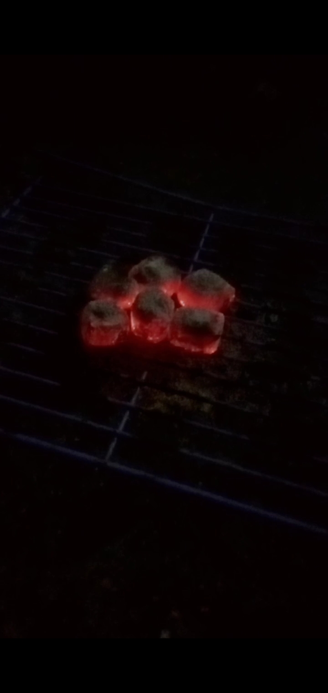

<!DOCTYPE html>
<html lang="id">
<head>
  <meta charset="UTF-8">
  <meta name="viewport" content="width=device-width, initial-scale=1.0">
  <title>Tirta Bara Mandiri - Briket Batok Kelapa</title>
  
</head>
<body>
  <header>
    <h1>Tirta Bara Mandiri</h1>
    
Briket Batok Kelapa Ramah Lingkungan

  </header>

  <section>
    <h2>Tentang Produk</h2>
    
Kami memproduksi <strong>briket batok kelapa</strong> bentuk kubus (2x2x2 cm) yang tidak berasap saat dibakar dan sangat cocok untuk keperluan memasak maupun kebutuhan industri.

    <!-- SLIDESHOW -->
    

      

        
      

      

        
      

      

        
      

      <a class="prev" onclick="plusSlides(-1)">❮</a>
      <a class="next" onclick="plusSlides(1)">❯</a>
    

  </section>

  <footer>
    &copy; 2025 Tirta Bara Mandiri. Semua Hak Dilindungi.
  </footer>

  
</body>
</html>
